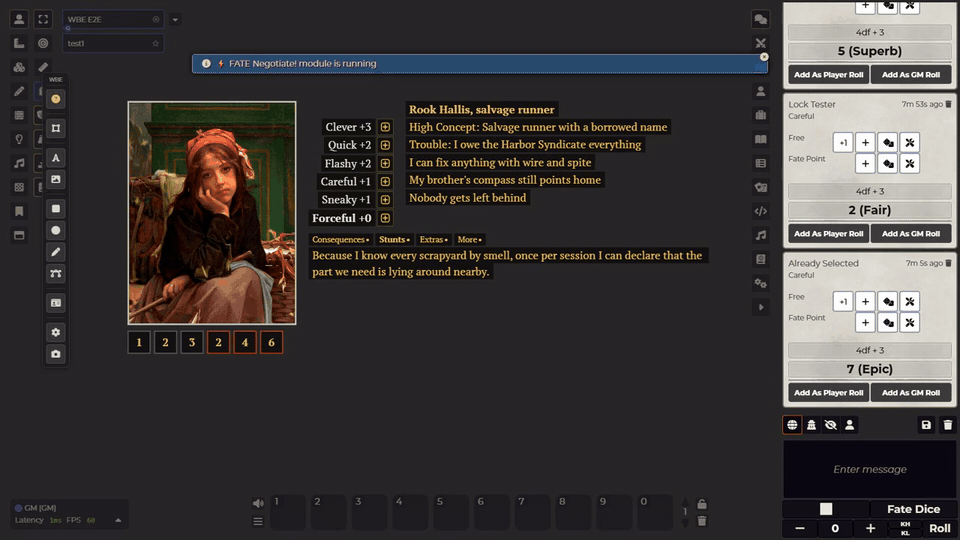
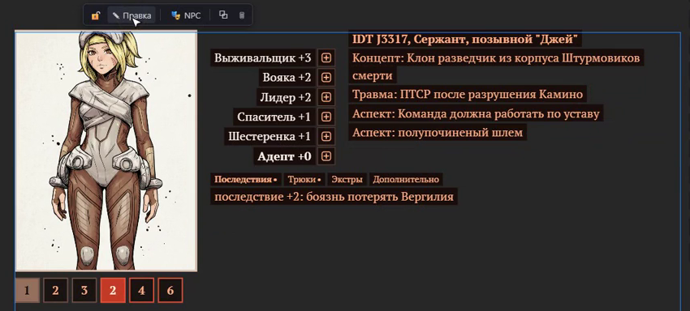

# Fate Card, Foundry 11+

A quick character card for Fate games, lying right on the [Whiteboard Experience](https://github.com/rokunin/whiteboard-experience) board.

**Requires Whiteboard Experience 0.9.1 or newer.**

## Why This Exists

I used to prep Fate tables in Miro: type a character's skills and aspects as plain text, drop a picture next to them, done. Character sheets always felt like filling out a form. This card keeps the Miro feeling (you type, you don't fill in fields) and adds the bits a table actually needs: dice, stress and consequence boxes, and a few tabs for the rest.

It is a notepad for a character, not a character sheet. No actors, no Fate system module, no windows.

## Using It

**Creating a card.** The GM creates cards with the card button on the WBE toolbar. Only the GM can create and delete them.

**Playing.** Click the die next to a skill to roll `4dF + skill` to chat (Dice So Nice picks it up). Click a stress or consequence box to mark it. Marking a red box opens the Consequences tab. The bottom tabs are Consequences, Stunts, Extras and More; each person picks their own tab.

**Editing.** Select the card and press **Edit** on its toolbar. Everything becomes editable:
- Enter adds a line, Backspace on an empty line removes it, ↑/↓ changes a skill value, Esc leaves edit mode.
- Double-click any text to fix just that line without entering edit mode.
- **Skill template** fills the list: FAE approaches, the Core pyramid (empty +4 to +1 slots; click a slot and pick a skill from the list), all 18 Core skills, or clear.
- Box rows: up to three rows of up to eight boxes, any numbers, grey or red frames.
- Portrait: click the frame to pick a file, paste a screenshot with Ctrl+V, or drop a file from disk. The ✥ button lets you drag the picture inside the frame, − and + zoom it, and you can switch the frame between the picture's shape, square and 3:4.
- **Themes**: seven colour schemes plus your own colours for skills, text, UI and the text background. **⚙**: card language (English or Russian) and text/UI sizes.
- Drag the corner handle to scale the card.

While someone edits a card, it is locked for everybody else until they finish. Changes go out when you leave a line, not on every keystroke.

**Lock.** The padlock stops a card from being moved or edited. Rolls and box marks still work.

**NPCs.** The GM can mark a card as an NPC. It looks the same, but players can only look at it. On NPC cards the GM can also hide single skills or aspects from players.

## Compatibility

Foundry VTT v11 to v14, with Whiteboard Experience 0.9.1 or newer.

## Installation

1. In Foundry, go to Add-on Modules → Install Module
2. Paste manifest URL: `https://raw.githubusercontent.com/rokunin/wbe-fate-card/main/module.json`
3. Enable Whiteboard Experience and Fate Card in your world

## Known Issues

- If someone drags a card at the same moment another player marks a box on it, the mark can be lost. Mark it again.
- Hiding fields from players is for convenience, not secrecy: the hidden text still reaches every player's browser.
- Cards made with the old prototype (before 0.3.0) are removed the first time the GM loads the world with this version.

## License

MIT

---

## Changelog

### v0.3.0

First public release, rebuilt from scratch on top of Whiteboard Experience 0.9.1.
