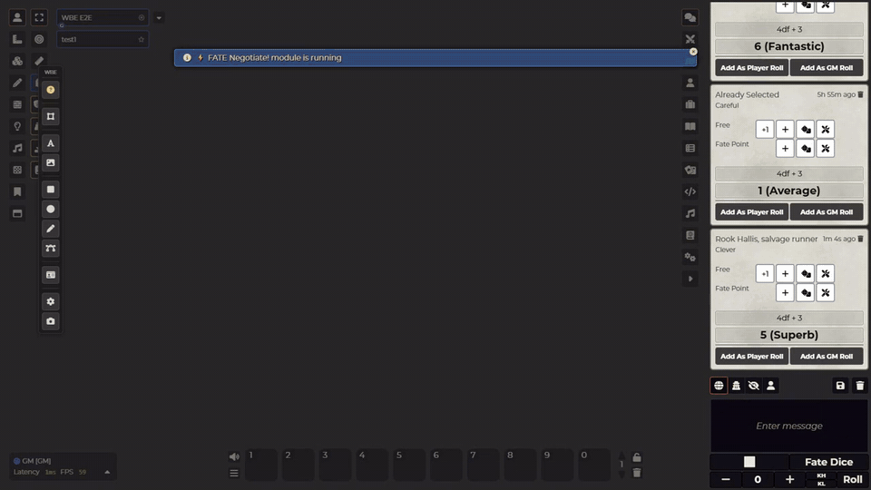
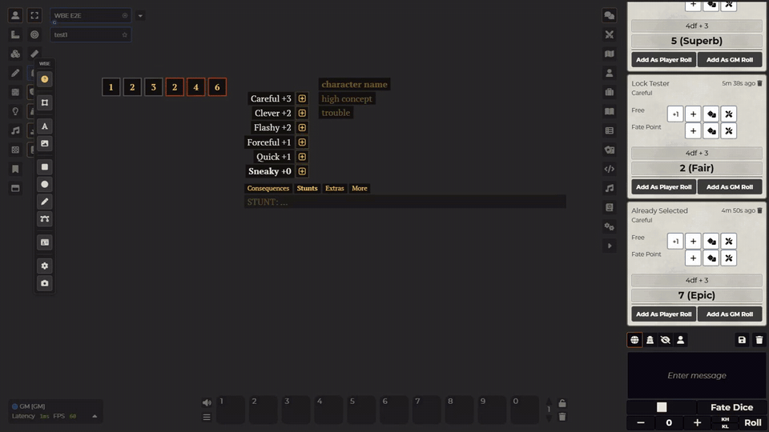

# Fate Card, Foundry 11+

A quick character card for Fate games, lying right on the [Whiteboard Experience](https://github.com/rokunin/whiteboard-experience) board.

**Requires Whiteboard Experience 0.9.3 or newer.**

## Why This Exists

I used to prep Fate tables in Miro / Figma: type a character's skills and aspects as plain text, drop a picture next to them, done. Character sheets via systems always felt bulky. All these modal windows and forms... Ugh.
This card tries to keep Miro / Figma approach and adds the bits your table actually needs: some easy automations, presets, dice, stress and consequence boxes, and a few tabs to have your extras, consequences Aspects and anything else you'd like to add.

## Using It

**Creating a card.** The GM creates cards with the card button on the WBE toolbar. Only the GM can create and delete them.

**Playing dice and some more.** Click the die next to a skill to roll `4dF + skill` to chat (Dice So Nice picks it up). Click a stress or consequence box to mark it. Marking a red box opens the Consequences tab. The bottom tabs are Consequences, Stunts, Extras and More.

**Editing.** Select the card and press **Edit** on its toolbar. Everything becomes editable:
- Enter adds a line, Backspace on an empty line removes it, ↑/↓ changes a skill value, Esc leaves edit mode.
- Double-click any text to fix just that line **without** entering edit mode.
- **Skill template** fills the list: FAE approaches, the Core pyramid (empty +4 to +1 slots; click a slot and pick a skill from the list), all 18 Core skills, or clear.
- Box rows: up to three rows of up to eight boxes, any numbers, grey or red frames.
- Portrait: click the frame to pick a file, drop a file from disk, or point at the portrait and press **Ctrl+V** to paste a screenshot you just copied. On https or localhost there is also a **📋 from clipboard** button that does it in one click. The ✥ button lets you drag the picture inside the frame, − and + zoom it, and you can switch the frame between the picture's shape, square and 3:4.
- **Themes**: seven colour schemes plus your own colours for skills, text, UI and the text background. **⚙**: card language (English or Russian) and text/UI sizes.
- Drag the corner handle to scale the card.

While someone edits a card, it is locked for everybody else until they finish. Changes go out when you leave a line, not on every keystroke.

**Lock.** The padlock stops a card from being moved or edited. Rolls, tabs and box marks still work.

**NPCs.** The GM can mark a card as an NPC. It looks the same, but players can only look at it. On NPC cards the GM can also hide single skills or aspects from players.

## Compatibility

Foundry VTT v11 to v14, with Whiteboard Experience 0.9.3 or newer.

## Installation

1. In Foundry, go to Add-on Modules → Install Module
2. Paste manifest URL: `https://raw.githubusercontent.com/rokunin/wbe-fate-card/main/module.json`
3. Enable Whiteboard Experience and Fate Card in your world

## Known Issues

- If someone drags a card at the same moment another player marks a box on it, the mark can be lost. Mark it again.
- Hiding fields from players is for convenience, not secrecy: the hidden text still reaches every player's browser.
- Cards made with the old prototype (before 0.3.0) are removed the first time the GM loads the world with this version.

## Credits

The portrait in the demos is *The Rag Picker* by Guillaume-Charles Brun (1870), public domain, via [Wikimedia Commons](https://commons.wikimedia.org/wiki/File:CharlesGuillaumeBrunRagGather.jpg).

## License

MIT

---

## Changelog

### v0.3.3

Needs Whiteboard Experience 0.9.3.

- New: marking a red (consequence) box adds a line for it to the Consequences tab, ready for you to write the consequence: "Mild (2): ", "Moderate (4): ", "Severe (6): " by the box's number, or just the number for other boxes. Unmarking the box removes the line again if you have not written anything after the label. It works on a locked card too, since marking does.
- New: paste a picture into the portrait with **Ctrl+V** while the pointer is over it (edit mode). Before, Ctrl+V never reached the portrait because the board takes Ctrl+V for itself. On https or localhost a **📋 from clipboard** button does the same in one click; on a plain http address, which is how players usually connect, the browser does not let a button read the clipboard, so it is not shown there.
- Fixed: a card always shows its three base aspects (high concept, trouble, aspect), empty or not, like the name field. Before, empty aspects disappeared when you left edit mode. An extra aspect left empty is still removed, and × on a base aspect clears it instead of shifting the others up.
- Fixed: an approaches card no longer opens the 18 Core skills when you add a row. The skill template you pick is the card's mode: with FAE approaches (the default) you can name rows anything and add as many as you like, with no suggestion list; with the Core pyramid or all 18 skills, the Core skills are suggested.
- The Consequences tab text is reddish.
- The name sits above the portrait, and a card without a portrait shows an empty square in its place. The aspects stay where they were.
- The open tab is easy to tell: it is underlined and at full brightness, the others are dimmed.
- Fixed: double-clicking an empty line (an aspect, a skill, the name) now shows the blinking text cursor. The line was ready for typing, but you could not see it.
- Fixed: a left click anywhere ends the line you are typing, also a click on the card itself. Before, only a click outside the card did.
- Fixed: Esc in a line, or Esc to leave portrait move mode, no longer also opens Foundry's main menu.
- The lowest skill or approach is no longer bold. On a new approaches card that made the last one look special for no reason.

### v0.3.2

- Fixed: with the text cursor still in a line, **+ aspect** and the **×** buttons on skills and aspects seemed to do nothing until you left edit mode, and the text you had just typed could get lost. They now work straight away.
- The blue selection frame lagging behind the card when you switch edit mode is fixed in Whiteboard Experience 0.9.2, so update that too.

### v0.3.1

- Fixed: in edit mode, clicking from one line straight into another (say, from the name into an empty aspect) sometimes left no text cursor, so you had to click twice.

### v0.3.0

First public release, rebuilt from scratch on top of Whiteboard Experience 0.9.1.
